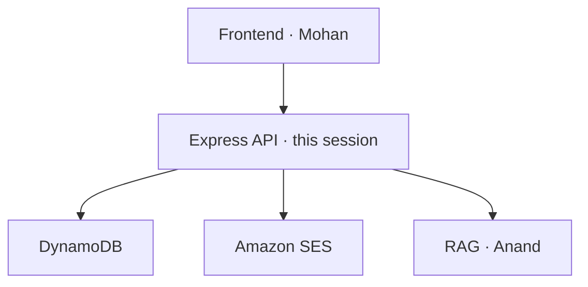

# Scope

The API layer. Nothing else.

| Portal requirement | On the API |
| --- | --- |
| Sign up / login | Auth routes |
| Forgot password | Token + SES |
| Members-only chat | Auth middleware |
| Who is logged in | `GET /me` |

| Demo bar | What we still ship |
| --- | --- |
| Local demo | Enough for the brief |
| Live AWS | Bonus — EC2 + domain so the story is lived |
