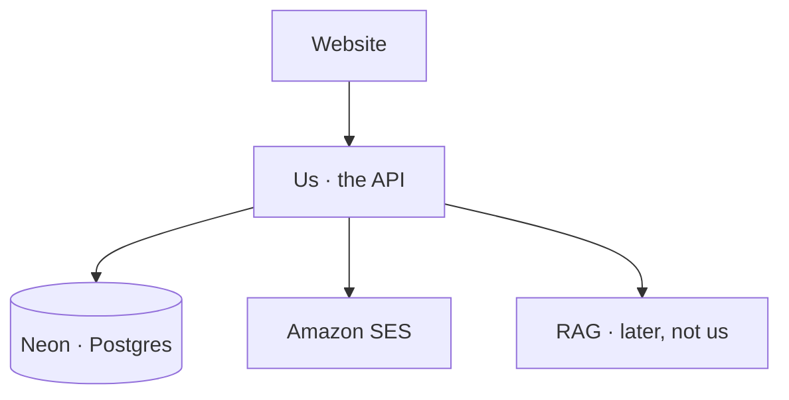

# Why we're even here

Picture a campus club. People want to join. Someone has to remember them, email them, and keep the group chat off-limits to randoms.

That someone is not the pretty website. The website is just a face. **We write the thing that actually decides.**

Today: only the API. Yes, no, and never store a password as text. That's it.

| They want | We actually build |
| --- | --- |
| Join | register + verify email |
| Come back | login + JWT |
| "wait, who am I?" | `GET /me` |
| Forgot password | email + new hash |
| Members chat | chat, but only if you're logged in |

If it runs on your laptop, judges are already happy. Putting it on a cheap Ubuntu box is extra — and **the public IP is enough**. Domain is if you happen to have one. Most of us don't. That's fine.
