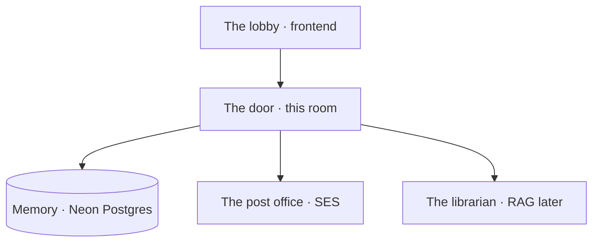

# The club needs a door

Imagine a campus club. People want in. Someone has to check who they are, send a mail, remember them next week, and keep the chat for members only.

That someone is not the pretty website. The website is the lobby. **We are the door.**

Today we build only the API — the thing that says yes or no, and never forgets a password in plaintext.

What a member actually wants, and what we name it:

| They want | We ship |
| --- | --- |
| Join the club | Register + verify mail |
| Come back tomorrow | Login + a ticket (JWT) |
| "Who am I?" | `GET /me` |
| Forgot the password | A reset mail, then a new hash |
| Talk in the members room | Chat, but only with a ticket |

A local demo already satisfies the brief. Putting it on Ubuntu behind Nginx is the extra chapter — **the public IP is enough**. A domain is a bonus if someone in the room already owns one.

Next: why the browser is not allowed to touch the database.
