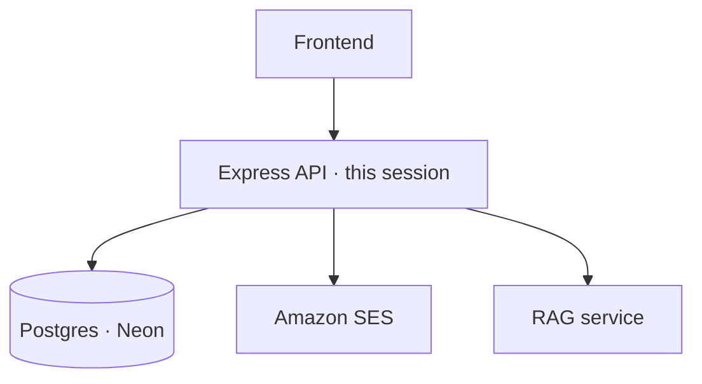

# Scope

Alright — today we're only building the **API**. Auth, who's logged in, email, and getting it onto a server. That's our lane.

| Portal needs this | We build it as |
| --- | --- |
| Sign up / login | Auth routes |
| Forgot password | Token + SES |
| Members-only chat | Auth middleware |
| Who is logged in | `GET /me` |

| What judges accept | What we're still doing |
| --- | --- |
| Local demo | Totally fine for the brief |
| Live AWS | Bonus — we're shipping EC2 + a domain so the story feels real |
