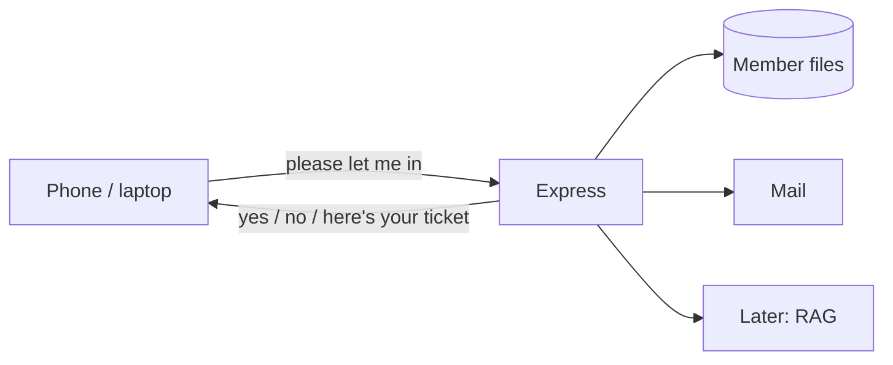

# The browser is not the bouncer

If the lobby could walk into the back office and read every member file, anyone with DevTools would own the club.

So we put a bouncer in the way. The browser only speaks HTTP. The bouncer (Express) checks the story, talks to Postgres and mail, and sends JSON back.

Three rules for the whole day:

1. **Passwords never sit as text** — we store a hash.
2. **Mail is how we prove you own the inbox** — not a checkbox on the form.
3. **Chat is a privilege** — no ticket, no room.

If it has to survive closing the laptop, it lives behind this door. Next we sketch the tiny set of URLs the frontend will ever call.
