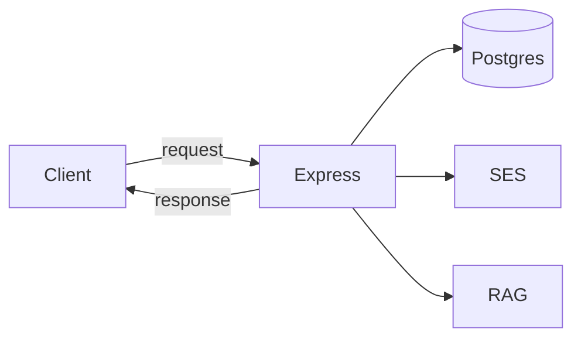

# What a backend is

Think of it this way: the browser should never poke the database directly. Your API is the only door.

Request comes in, we apply rules, JSON goes back out. Anything that needs to survive a restart lives behind that door.
