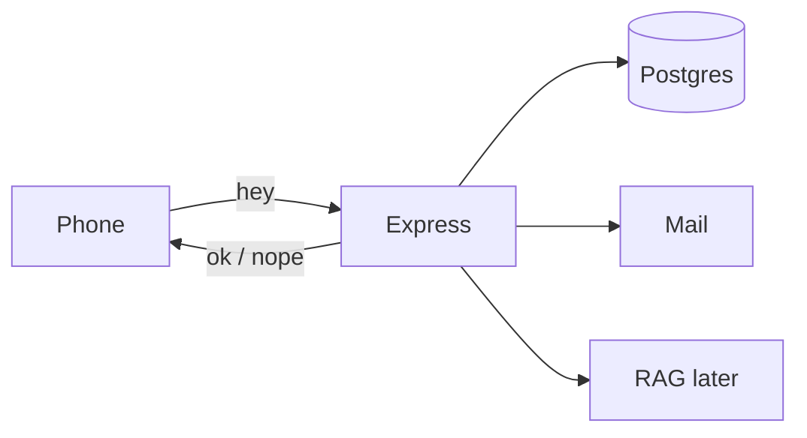

# The browser is a gossip

If the website could talk to the database directly, anyone who opens DevTools owns every member. I've seen people try. Don't.

So the browser only talks HTTP. Express sits in the middle, checks stuff, hits Postgres and mail, sends JSON back.

Three things I will be annoying about all day:

1. We hash passwords. Always.
2. A checkbox is not "I own this email." Mail is.
3. Chat is for people who logged in. Period.

If it has to still be there after you slam the laptop, it lives on our side. Not in React state.
