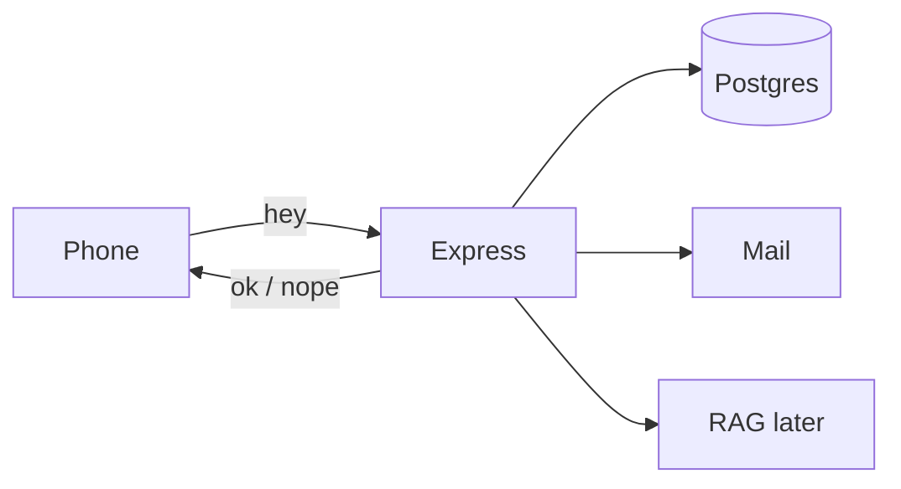

# Why the browser is not allowed near the database

If the website talked to Postgres directly, anyone who opens DevTools could read every member. So the browser only speaks HTTP. **Your** Express app sits in the middle: check the request, talk to Neon and SES, send JSON back.

Three rules we keep all day — write them on a sticky note:

1. We **hash** passwords. Always.
2. A checkbox is not proof of email. **Mail** is.
3. Chat is only for people who logged in.

If it still has to exist after you close the laptop, it lives on the server. Not in React state.
