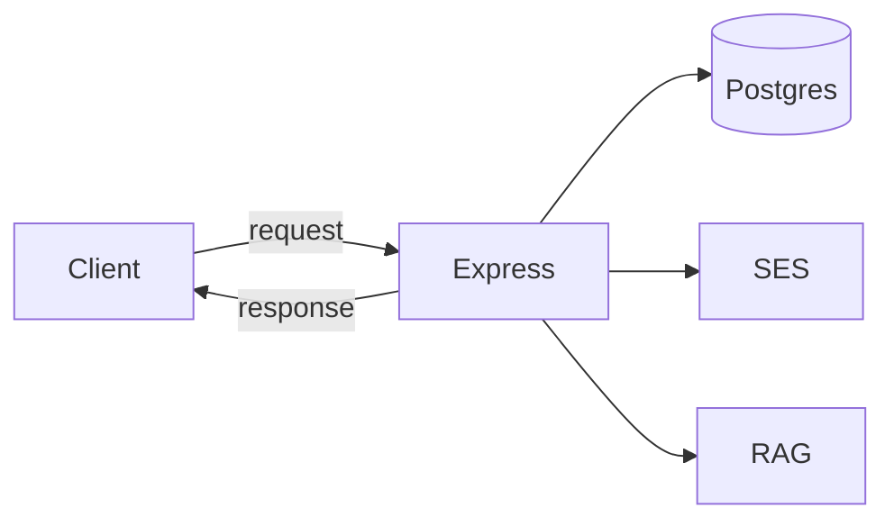

# What a backend is

The browser never talks to the database. Your API is the only door in.

```mermaid
flowchart LR
  C[Client] -->|request| E[Express]
  E --> D[(Postgres)]
  E --> S[SES]
  E --> R[RAG]
  E -->|response| C
```

A backend accepts HTTP, applies rules, and returns JSON. Everything durable lives behind it.
