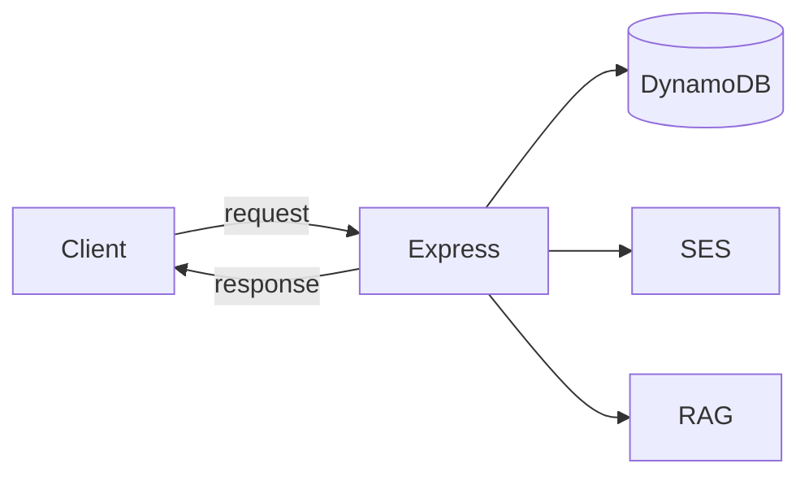

# What a backend is

A process that accepts HTTP, applies rules, and returns JSON.

```mermaid
flowchart LR
  C[Client] -->|request| E[Express]
  E --> D[(DynamoDB)]
  E --> S[SES]
  E --> R[RAG]
  E -->|response| C
```

The browser never touches the database.  
The API is the only door.
