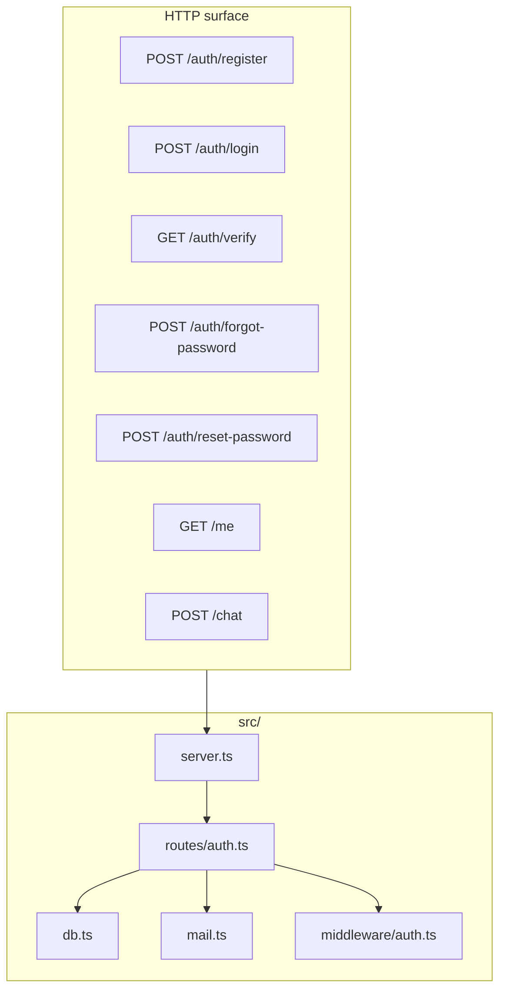

# Shape of the service

We're keeping the HTTP surface tiny on purpose — so whoever builds the UI has a clean contract to call.



```text
club-portal-backend/
├── prisma/schema.prisma
├── src/
│   ├── prisma.config.ts    ← inside rootDir so tsc is happy
│   ├── generated/prisma/   ← prisma generate (do not hand-edit)
│   ├── server.ts
│   ├── db.ts
│   ├── mail.ts
│   ├── middleware/auth.ts
│   └── routes/
├── .env
├── package.json
└── tsconfig.json
```

If you can point at a folder and say what it does in one sentence, you're in good shape.
