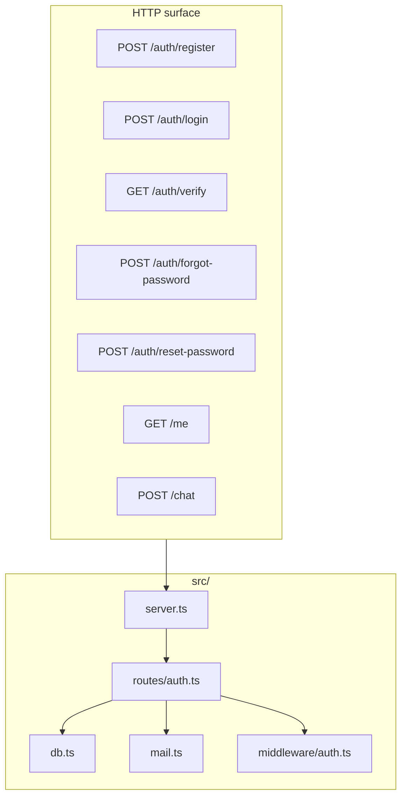

# Shape of the service

Keep the HTTP surface small so the frontend has a clear contract.



```text
club-portal-backend/
├── prisma/schema.prisma
├── src/
│   ├── server.ts
│   ├── db.ts
│   ├── mail.ts
│   ├── middleware/auth.ts
│   └── routes/
├── .env
├── package.json
└── tsconfig.json
```
