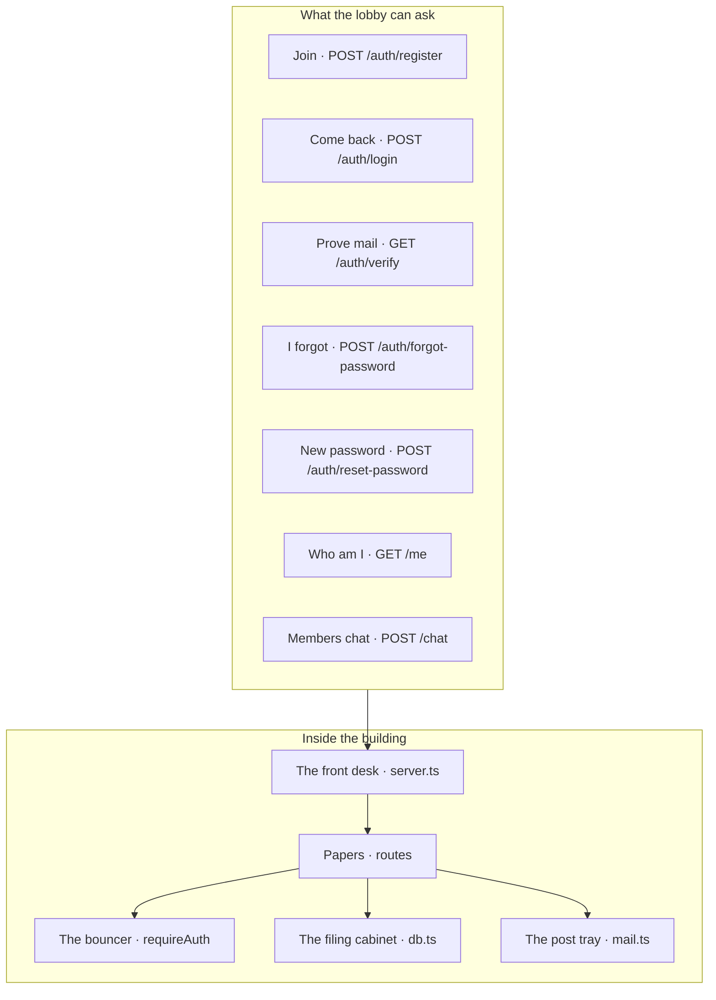

# Seven doors, one building

We don't invent fifty endpoints. A club portal needs seven public moves. Everything else is folders so we can find the bouncer at 2am.



When we open the laptop later, this is the map — not a dump of filenames for its own sake:

```text
club-portal-backend/
├── prisma/          the shape of member + token rows
├── src/server.ts    the one process we start
├── src/db.ts        one shared database client
├── src/mail.ts      every outbound letter
├── src/middleware/  "show me your ticket"
├── src/routes/      join, me, chat
└── .env             secrets — never git
```

If you can point at a box and say it in one sentence, you're ready. Next we get Node and a machine identity on AWS — so later the same keys send mail.
