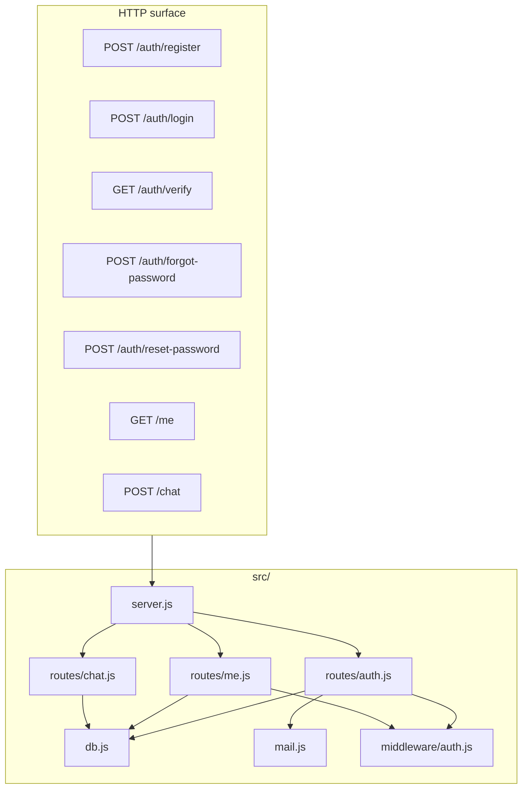

# Shape of the service



```text
club-portal-backend/
├── src/
│   ├── server.js
│   ├── db.js          # typed data access
│   ├── mail.js
│   ├── middleware/auth.js
│   └── routes/
├── .env
└── package.json
```
