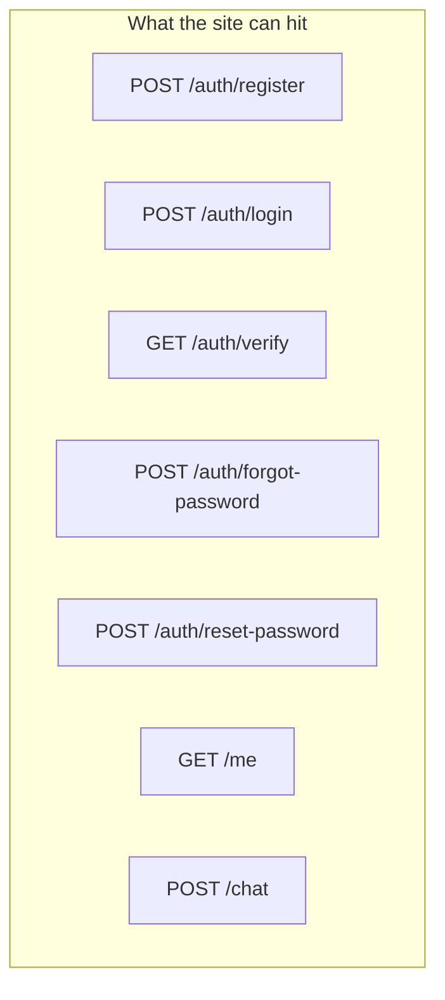

# We only need seven URLs

I'm not inventing a REST museum. A club needs like seven things the frontend can call. Folders exist so we don't cry at 2am.



How I keep it in my head:

```text
club-portal-backend/
├── prisma/            tables
├── src/server.ts      the process we start
├── src/db.ts          one Prisma client, shared
├── src/mail.ts        every email goes through here
├── src/middleware/    "got a token?"
├── src/routes/        the seven URLs
└── .env               secrets. not git. ever.
```

If you can point at a folder and say what it does in one breath, you're good.
