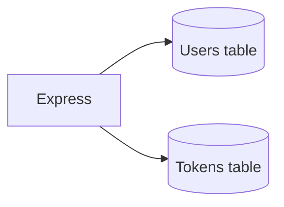

# DynamoDB

Process memory dies on restart. The table does not.



| Table | Keys | Holds |
| --- | --- | --- |
| `club-portal-users` | PK `email` | profile, password hash, verified |
| `club-portal-tokens` | PK `token` | verify / reset, expiry, userEmail |

```bash
aws dynamodb create-table \
  --table-name club-portal-users \
  --attribute-definitions AttributeName=email,AttributeType=S \
  --key-schema AttributeName=email,KeyType=HASH \
  --billing-mode PAY_PER_REQUEST \
  --region ap-south-1

aws dynamodb create-table \
  --table-name club-portal-tokens \
  --attribute-definitions AttributeName=token,AttributeType=S \
  --key-schema AttributeName=token,KeyType=HASH \
  --billing-mode PAY_PER_REQUEST \
  --region ap-south-1
```

`PAY_PER_REQUEST` — no idle capacity bill while you learn.

Prisma speaks SQL and Mongo. DynamoDB is a different engine — we keep Prisma-shaped call sites in `db.js` so routes stay clean.
