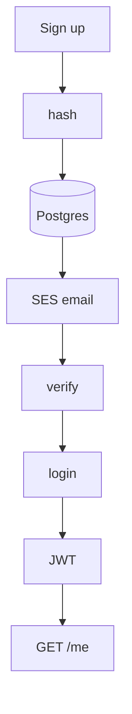

# One person, start to finish

The brief said email + password. So we're not building Google login. Watch one human:

They sign up. We hash. We mail a link. They prove the inbox (or we curl the token because Gmail shoved it in Spam). Then they log in and we give them a JWT. That's how they ask "who am I" and how they get into chat.

**Auth** = who are you. **Authz** = are you allowed in this room. Chat is the second one. People mix them up constantly.
