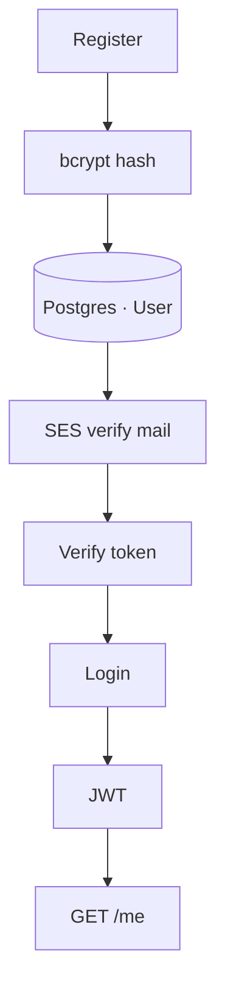

# Auth model

The brief says email + password is enough. So that's what we're building — no Google login rabbit hole.

Quick vocab while we're here: **authentication** is "who are you?", **authorization** is "are you allowed?" Chat is the second one.
