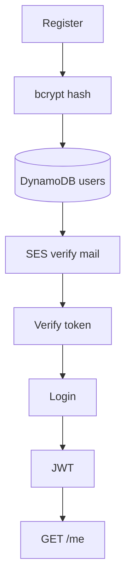

# Auth model

Email + password. Matches the brief.

```mermaid
flowchart TB
  R[Register] --> H[bcrypt hash]
  H --> U[(DynamoDB users)]
  U --> M[SES verify mail]
  M --> V[Verify token]
  V --> L[Login]
  L --> J[JWT]
  J --> ME[GET /me]
```

Authentication answers *who*.  
Authorization answers *allowed*. Chat is the latter.
