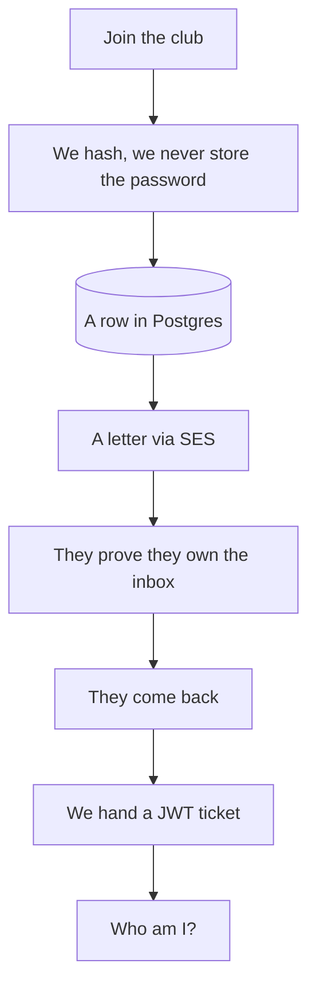

# A member's day

The brief said email + password. So we don't detour into Google login. Watch one person walk through the club:

They **join**. We hash the password. We email a proof link. They **click** (or we curl the token). Only then can they **come back** and get a **ticket**. The ticket is how they ask "who am I?" and how they enter chat.

Two words for the rest of the day:

- **Authentication** — who are you?
- **Authorization** — are you allowed in this room?

Chat is the second one. Next we write join.
