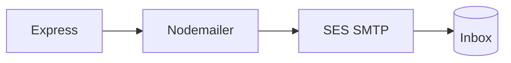

# Amazon SES

Nodemailer is our postman. SES is the real post office — and it's what you mention in the AWS pitch.



| Step | What you click / paste |
| --- | --- |
| 1 | SES → Identities → verify your From address |
| 2 | SMTP settings → create credentials (save them once) |
| 3 | Drop those into `.env` |

```bash
SMTP_HOST=email-smtp.ap-south-1.amazonaws.com
SMTP_PORT=587
SMTP_USER=…
SMTP_PASS=…
MAIL_FROM="Club Portal <verified@address>"
```

| If you see this | It usually means |
| --- | --- |
| MessageRejected | From isn't verified |
| Sandbox block | To isn't verified yet |
| Auth error | Wrong SMTP secret or wrong region |

New accounts start in sandbox — you can only mail verified addresses until AWS opens production for you.
