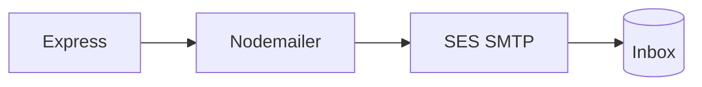

# Amazon SES



1. SES → Identities → verify From  
2. SMTP settings → create credentials  
3. Point `.env` at the regional endpoint

```bash
SMTP_HOST=email-smtp.ap-south-1.amazonaws.com
SMTP_PORT=587
SMTP_USER=…
SMTP_PASS=…
MAIL_FROM="Club Portal <verified@address>"
```

Sandbox: verified recipients only. Production access when you need the open net.
