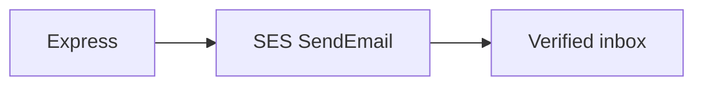

# Amazon SES

SES is the post office. The IAM user from slide 4 (`club-portal-cli` + access keys + `aws configure`) is what Node uses. Stay in **ap-south-1**.

**Webinar day: verify an email address. Nobody in the room needs a domain.** Gmail, Outlook, or college mail all work. Domain identities are a later production step — skip them today.



## 1. New accounts are in the sandbox

You **cannot** email arbitrary people yet. Sandbox rules:

| | Allowed |
| --- | --- |
| From | a **verified email identity** |
| To | a **verified email identity** |
| Volume | 200 / day |

This account's verified identities (both `SUCCESS`):

| Identity | Use |
| --- | --- |
| `sreecharan309@gmail.com` | `MAIL_FROM` (sender) and a register demo |
| `o210008@rguktong.ac.in` | second inbox — register as this to prove To ≠ From |

Check:

```bash
aws sts get-caller-identity
# Arn should end with user/club-portal-cli

aws sesv2 get-account --query ProductionAccessEnabled
# false = sandbox

aws sesv2 list-email-identities
```

## 2. Verify *your* inbox (required — not a domain)

Every attendee does this with **the mail they can actually open**.

1. Console: [SES Identities · ap-south-1](https://ap-south-1.console.aws.amazon.com/ses/home?region=ap-south-1#/identities)
2. **Create identity** → **Email address** — not Domain
3. Paste your address (example: `you@gmail.com` or `you@rguktong.ac.in`) → create
4. Open **that** inbox, click the AWS link. Status **Verified** / `SUCCESS`

If AWS says the identity already exists, you're done. Don't recreate it.

`MAIL_FROM` must be **one of your verified addresses**. You cannot From: `club@madeup-domain.com`.

## 3. Second inbox (optional, same trick)

Still sandbox: verify the other address the same way, or:

```bash
aws sesv2 create-email-identity --email-identity o210008@rguktong.ac.in
```

They click the AWS link. Then register can `To:` that mailbox while `MAIL_FROM` stays Gmail.

**Send to anyone** (not today): SES → Account dashboard → **Request production access**. Hours to days. Skip for the webinar.

## 4. `.env`

Do **not** put `AWS_ACCESS_KEY_ID` in `.env`. The SDK reads `~/.aws/credentials` from `aws configure`.

```bash
AWS_REGION=ap-south-1
MAIL_FROM=sreecharan309@gmail.com
```

Leave `SMTP_HOST` unset so `mail.ts` uses SES.

Never use a host like `….mail-manager-smtp.amazonaws.com`. That is Mail Manager **ingress**: SMTP can return 250 and mail still never arrives.

Gmail/college mail often lands in **Spam**. That is normal in sandbox — the pipe worked.

## 5. What the verify email looks like (expect this)

After register, open **Spam** on the recipient inbox (example: `o210008@rguktong.ac.in`).


| What you see | Why |
| --- | --- |
| **External** / **Spam** badges | Gmail does not trust `@gmail.com` sent **via** `amazonses.com` yet (no domain DKIM) |
| Red “might be dangerous” banner | Plain link + `localhost` in the body looks like phishing to filters |
| `sreecharan309@gmail.com` **via** `amazonses.com` | SES sent it — that is correct for this workshop |
| Body is only `http://localhost:4000/auth/verify?token=…` | `APP_URL` in `.env` is local. Fine for today |

**For the demo:** copy the `token=` value from that link (or curl verify with it). Do **not** click the link in the browser on event day unless the API is on your laptop — college mail web on another machine cannot reach your `localhost`.

```bash
# paste the token from the email body
curl -s "http://localhost:4000/auth/verify?token=PASTE_TOKEN_HERE"
```

Production fixes this later: real `APP_URL`, HTML template, verified domain + DKIM. Today we only prove SES → inbox → token → login.

| If you see this | It usually means |
| --- | --- |
| MessageRejected / not authorized to send | **To** is not a verified identity (sandbox) |
| MessageRejected on From | `MAIL_FROM` isn't a verified address, or wrong region |
| CredentialsProviderError | `aws configure` never saved the access keys |
| Empty inbox, no API error | check Spam; identities must be in **ap-south-1** |
