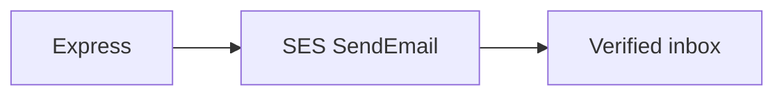

# Amazon SES

SES is the post office. The IAM user from slide 4 (`club-portal-cli` + access keys + `aws configure`) is what Node uses. Stay in **ap-south-1**.



## 1. New accounts are in the sandbox

You **cannot** email arbitrary people yet. Sandbox rules:

| | Allowed |
| --- | --- |
| From | a **verified** identity |
| To | a **verified** identity (usually the same Gmail) |
| Volume | 200 / day |

Check:

```bash
aws sts get-caller-identity
# Arn should end with user/club-portal-cli

aws sesv2 get-account --query ProductionAccessEnabled
# false = sandbox

aws sesv2 list-email-identities
```

## 2. Verify your Gmail (required)

1. Console: [SES Identities · ap-south-1](https://ap-south-1.console.aws.amazon.com/ses/home?region=ap-south-1#/identities)
2. **Create identity** → **Email address** (not Domain)
3. Paste `sreecharan309@gmail.com` → create → click the AWS link in that inbox
4. Status **Verified** / `SUCCESS`

`MAIL_FROM` must be that exact address.

## 3. How to email someone else (testing)

Pick one. Do not skip this or register will return 500 (`MessageRejected`).

**A — stay in sandbox (today's path).** Verify each recipient the same way, or:

```bash
aws sesv2 create-email-identity --email-identity friend@college.edu
```

They click the AWS verify link. Then you can `To:` them. Demo register as yourself first.

**B — send to anyone.** SES → Account dashboard → **Request production access**. Use case: transactional (verify + password reset). That review can take hours to days — not required for this class.

## 4. `.env`

Do **not** put `AWS_ACCESS_KEY_ID` in `.env`. The SDK reads `~/.aws/credentials` from `aws configure`.

```bash
AWS_REGION=ap-south-1
MAIL_FROM=sreecharan309@gmail.com
```

Leave `SMTP_HOST` unset so `mail.ts` uses SES.

Never use a host like `….mail-manager-smtp.amazonaws.com`. That is Mail Manager **ingress**: SMTP can return 250 and Gmail still never arrives.

Gmail-as-From can land in **Spam**. Check there.

| If you see this | It usually means |
| --- | --- |
| MessageRejected / not authorized to send | **To** is not a verified identity (sandbox) |
| MessageRejected on From | `MAIL_FROM` isn't the verified address, or wrong region |
| CredentialsProviderError | `aws configure` never saved the access keys |
| Empty inbox, no API error | check Spam; confirm `ProductionAccessEnabled` and identities in **ap-south-1** |
