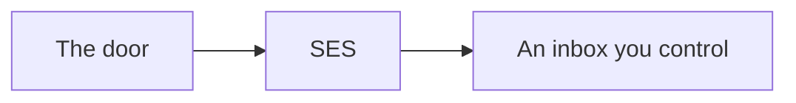

# The post office, no domain required

Amazon SES is the post office. The robot user from slide 4 is who pays the postage. Stay in **ap-south-1**.

**Webinar day: verify an email you can open.** Gmail, Outlook, college mail. Domain identities are a later chapter — skip them today.



## New accounts live in a sandbox

You cannot write to the whole internet yet.

| | Allowed |
| --- | --- |
| From | a verified **email** identity |
| To | a verified **email** identity |
| Volume | 200 / day |

This workshop account already verified:

| Identity | In the story |
| --- | --- |
| `sreecharan309@gmail.com` | The sender (`MAIL_FROM`) |
| `o210008@rguktong.ac.in` | A second member — To ≠ From |

```bash
aws sts get-caller-identity
aws sesv2 get-account --query ProductionAccessEnabled   # false = sandbox
aws sesv2 list-email-identities
```

## Every attendee: verify *your* inbox

1. [SES Identities · ap-south-1](https://ap-south-1.console.aws.amazon.com/ses/home?region=ap-south-1#/identities)
2. **Create identity** → **Email address** — not Domain
3. Paste the address you can open → create → click AWS's link in **that** inbox

`MAIL_FROM` must match a verified address. You cannot From: `club@fake-domain.com`.

Second inbox (same trick):

```bash
aws sesv2 create-email-identity --email-identity o210008@rguktong.ac.in
```

**Send to anyone** is production access — hours to days. Skip for class.

`.env` — still no access keys in this file:

```bash
AWS_REGION=ap-south-1
MAIL_FROM=sreecharan309@gmail.com
```

Leave `SMTP_HOST` unset. Do not use `….mail-manager-smtp.amazonaws.com` — that can return 250 while Gmail never arrives.

## What the letter looks like (expect this)

It will sit in **Spam**. That means the pipe worked.


| What you see | The story |
| --- | --- |
| Spam / External | Gmail doesn't fully trust Gmail-via-SES yet |
| Red "dangerous" banner | A bare `localhost` link looks like phishing |
| `via amazonses.com` | SES sent it. Correct. |
| Only a localhost URL | `APP_URL` is local. Fine for today. |

**Demo:** copy `token=` and curl verify. Do **not** click localhost in webmail on another machine — it cannot reach your laptop.

```bash
curl -s "http://localhost:4000/auth/verify?token=PASTE_TOKEN_HERE"
```

Next: we honour that token in the API.
