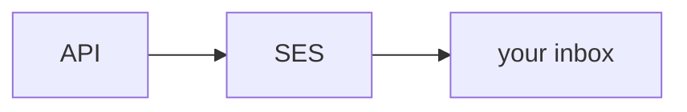

# SES, without buying a domain

Amazon SES sends the mail. Stay in **ap-south-1**. Same IAM user as before.

**You do not need a domain.** Gmail, Outlook, college mail. Verify the address you can actually open.



New AWS accounts are in a **sandbox**. You cannot email the whole planet.

| | Allowed |
| --- | --- |
| From | a verified email |
| To | a verified email |
| Volume | 200 / day |

We've already verified:

| Address | Use |
| --- | --- |
| `sreecharan309@gmail.com` | From (`MAIL_FROM`) |
| `o210008@rguktong.ac.in` | a second person signing up |

```bash
aws sts get-caller-identity
aws sesv2 get-account --query ProductionAccessEnabled
aws sesv2 list-email-identities
```

You: [SES Identities](https://ap-south-1.console.aws.amazon.com/ses/home?region=ap-south-1#/identities) → create identity → **Email address** (not Domain) → click the AWS link in **that** inbox.

Don't From: `club@made-up.com`. SES will laugh.

Want a second inbox?

```bash
aws sesv2 create-email-identity --email-identity o210008@rguktong.ac.in
```

"Send to anyone" is production access. Takes forever. Skip it today.

```bash
AWS_REGION=ap-south-1
MAIL_FROM=sreecharan309@gmail.com
```

Leave SMTP out of `.env`. We never installed Nodemailer. If you point at `*.mail-manager-smtp.amazonaws.com`, SMTP says 250 and Gmail never shows up.

## It will land in Spam. That's success.


Gmail sees Gmail-via-SES plus a `localhost` link and freaks out. Red banner. External. Whatever.

**Don't click the link in college webmail.** That browser is not your laptop. Copy `token=` and curl:

```bash
curl -s "http://localhost:4000/auth/verify?token=PASTE_TOKEN_HERE"
```
