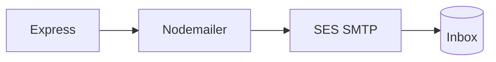

# Amazon SES

Nodemailer is our postman. SES is the real post office — and it's what you mention in the AWS pitch.

You do **not** need a custom domain. Most of this room is on Gmail. SES can verify a **single email address**. That's the path we use today.



## 1. Verify an email identity (no domain)

Stay in **ap-south-1** (Mumbai) — same region as `aws configure`.

1. Open **Amazon SES** → **Get set up** (or **Configuration → Identities**)
2. On **Verify sending domain**, click **Create identity** — ignore that it says "domain". Next screen lets you pick the type.
3. Identity type: **Email address** — not Domain
4. Paste the Gmail (or college mail) you can actually open
5. **Create identity**
6. Open that inbox. Click the AWS verification link. Status should go **Verified**.


If AWS says the identity already exists, you're done — it's already in Identities. Don't recreate it.

`MAIL_FROM` must be **that exact verified address**. You cannot From: `club@madeup-domain.com` until a domain is verified.

Gmail-as-From can land in spam (DMARC). For a workshop that's fine. We're proving the pipe, not winning inboxes.

## 2. SMTP credentials

SES → **SMTP settings** → create SMTP credentials. Save the user and password **once** — you won't see the password again.

## 3. `.env`

```bash
SMTP_HOST=email-smtp.ap-south-1.amazonaws.com
SMTP_PORT=587
SMTP_USER=…
SMTP_PASS=…
MAIL_FROM="Club Portal <you@gmail.com>"
```

Host must match the region (`ap-south-1`). Wrong region = auth errors.

| If you see this | It usually means |
| --- | --- |
| MessageRejected | From isn't the verified email |
| Sandbox block | **To** isn't verified yet — sandbox only delivers to verified identities. Verify the recipient the same way, or send to yourself. |
| Auth error | Wrong SMTP secret or `SMTP_HOST` region doesn't match the console |

New accounts start in **sandbox** (200 mail / day). Production access wants a domain later — skip that for class.
