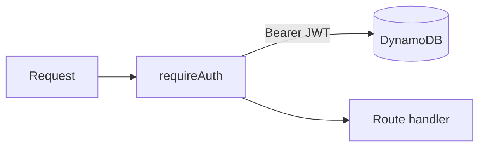

# Auth middleware



`src/middleware/auth.js`

```js
const jwt = require("jsonwebtoken");
const { db } = require("../db");

async function requireAuth(req, res, next) {
  try {
    const [scheme, token] = String(req.headers.authorization || "").split(" ");
    if (scheme !== "Bearer" || !token) {
      return res.status(401).json({ error: "unauthorized" });
    }

    const payload = jwt.verify(token, process.env.JWT_SECRET);
    const user = await db.user.findUnique({ where: { email: payload.email } });
    if (!user) return res.status(401).json({ error: "unauthorized" });

    req.user = {
      id: user.id,
      email: user.email,
      name: user.name,
      isVerified: user.isVerified,
    };
    next();
  } catch {
    return res.status(401).json({ error: "unauthorized" });
  }
}

module.exports = { requireAuth };
```
