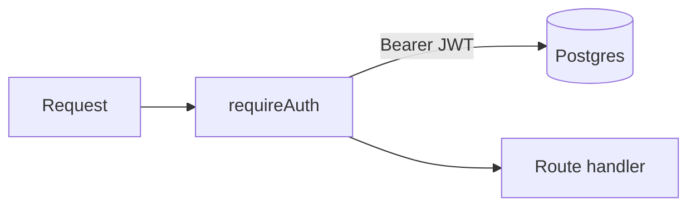

# Auth middleware

This is the bouncer. Members-only routes don't even run until the ticket checks out.



`src/middleware/auth.ts`

```ts
import type { Request, Response, NextFunction } from "express";
import jwt from "jsonwebtoken";
import prisma from "../db.ts";

export type AuthedRequest = Request & {
  user?: { id: string; email: string; name: string | null; isVerified: boolean };
};

export async function requireAuth(req: AuthedRequest, res: Response, next: NextFunction) {
  try {
    const [scheme, token] = String(req.headers.authorization ?? "").split(" ");
    if (scheme !== "Bearer" || !token) {
      return res.status(401).json({ error: "unauthorized" });
    }

    const payload = jwt.verify(token, process.env.JWT_SECRET!) as { sub: string; email: string };
    const user = await prisma.user.findUnique({ where: { id: payload.sub } });
    if (!user) return res.status(401).json({ error: "unauthorized" });

    req.user = {
      id: user.id,
      email: user.email,
      name: user.name,
      isVerified: user.isVerified,
    };
    next();
  } catch {
    return res.status(401).json({ error: "unauthorized" });
  }
}
```

Hang this on chat (and anything else that shouldn't be public).
