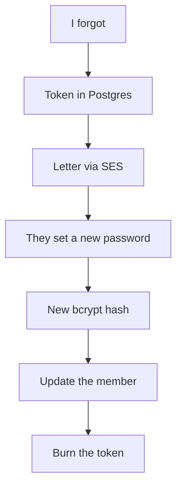

# They lost the password

The brief requires this. Same pattern as verify: a short-lived token in Postgres, a letter, a new hash, burn the token.

On **forgot**, we always say "if the account exists…" — we don't confirm emails to strangers.



```ts
router.post("/forgot-password", async (req, res) => {
  try {
    const email = String(req.body.email ?? "").trim().toLowerCase();
    const generic = { message: "if the account exists, a reset link was sent" };
    const user = await prisma.user.findUnique({ where: { email } });
    if (!user) return res.json(generic);

    const token = crypto.randomBytes(32).toString("hex");
    await prisma.emailToken.create({
      data: {
        token,
        purpose: "reset",
        expiresAt: new Date(Date.now() + 18e5),
        userId: user.id,
      },
    });
    await sendMail({
      to: email,
      subject: "Reset password",
      text: `${process.env.APP_URL}/reset-password?token=${token}`,
    });
    res.json(generic);
  } catch (err) {
    console.error(err);
    res.status(500).json({ error: "forgot password failed" });
  }
});

router.post("/reset-password", async (req, res) => {
  try {
    const token = String(req.body.token ?? "");
    const password = String(req.body.password ?? "");
    if (!token || password.length < 8) {
      return res.status(400).json({ error: "token and password required" });
    }

    const row = await prisma.emailToken.findUnique({ where: { token } });
    if (!row || row.purpose !== "reset" || row.usedAt) {
      return res.status(400).json({ error: "invalid token" });
    }
    if (row.expiresAt < new Date()) {
      return res.status(400).json({ error: "token expired" });
    }

    const passwordHash = await bcrypt.hash(password, 10);
    await prisma.user.update({ where: { id: row.userId }, data: { passwordHash } });
    await prisma.emailToken.update({ where: { token }, data: { usedAt: new Date() } });
    res.json({ ok: true });
  } catch (err) {
    console.error(err);
    res.status(500).json({ error: "reset failed" });
  }
});
```

Next: the members room — even if RAG isn't wired yet.
