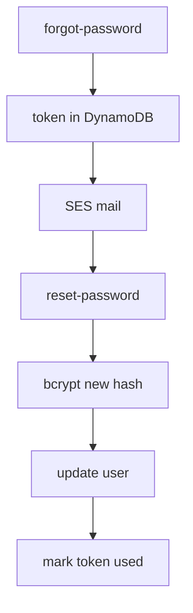

# Password reset



```js
router.post("/forgot-password", async (req, res) => {
  const email = String(req.body.email || "").trim().toLowerCase();
  const generic = { message: "if the account exists, a reset link was sent" };
  const user = await db.user.findUnique({ where: { email } });
  if (!user) return res.json(generic);

  const token = crypto.randomBytes(32).toString("hex");
  await db.token.create({
    data: {
      token,
      userEmail: email,
      purpose: "reset",
      expiresAt: new Date(Date.now() + 18e5).toISOString(),
    },
  });
  await sendMail({
    to: email,
    subject: "Reset password",
    text: `${process.env.APP_URL}/reset-password?token=${token}`,
  });
  res.json(generic);
});

router.post("/reset-password", async (req, res) => {
  const token = String(req.body.token || "");
  const password = String(req.body.password || "");
  if (!token || password.length < 8) {
    return res.status(400).json({ error: "token and password required" });
  }

  const row = await db.token.findUnique({ where: { token } });
  if (!row || row.purpose !== "reset" || row.usedAt) {
    return res.status(400).json({ error: "invalid token" });
  }
  if (new Date(row.expiresAt) < new Date()) {
    return res.status(400).json({ error: "token expired" });
  }

  const passwordHash = await bcrypt.hash(password, 10);
  await db.user.update({
    where: { email: row.userEmail },
    data: { passwordHash },
  });
  await db.token.update({
    where: { token },
    data: { usedAt: new Date().toISOString() },
  });
  res.json({ ok: true });
});
```
