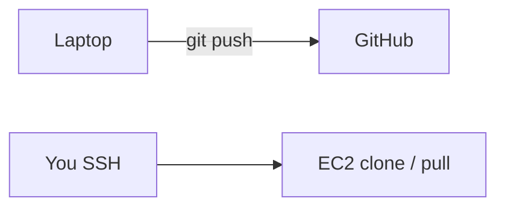

# How we ship today vs later

**Today we did not finish CI/CD.** Be honest with the room.

What we actually did:

1. Push the repo to GitHub (public)
2. SSH into EC2
3. `git clone` once, `npm ci`, `pm2 start`

To ship a change after that: SSH again, `git pull`, `pm2 restart`. Ugly. Works. That's this webinar.

**Later** (not wired yet): GitHub Actions + three repo secrets. Then a push from your laptop would SSH for you. We didn't add the secrets. We didn't prove a push updates the box. Don't demo a green check that isn't there.
