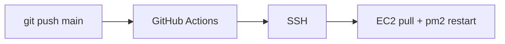

# Delivery pipeline

Every push to `main` should prove the app boots, then update the server without a manual ritual.

```mermaid
flowchart LR
  P[git push main] --> A[GitHub Actions]
  A --> S[SSH]
  S --> H[EC2 pull + pm2 restart]
```
