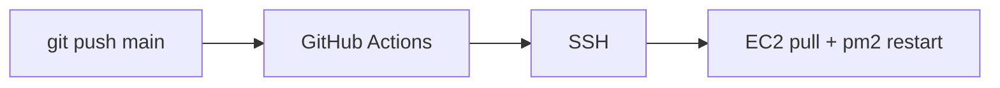

# Delivery pipeline

We don't want to SSH and copy-paste forever. Push to `main`, let a robot check it, then update the box.

```mermaid
flowchart LR
  P[git push main] --> A[GitHub Actions]
  A --> S[SSH]
  S --> H[EC2 pull + pm2 restart]
```

CI says "it still boots." CD says "and now the server has it."
