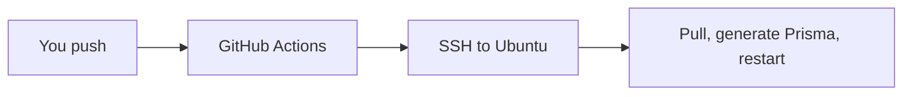

# A robot ships while we sleep

We don't want to SSH and paste forever. Push to `main`. A robot checks the types. Then it updates the box.

CI means "it still boots." CD means "and the live door has it." Next: the YAML that does that.
