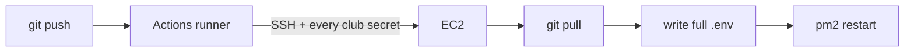

# Push, and the box updates

A push to `main` runs **Deploy API**. GitHub's runner SSHs in, `git pull`s, writes the **whole** app `.env` from club secrets, restarts pm2.

**Two kinds of GitHub secrets.** Don't mix them.

| Pile | Secrets | Job |
| --- | --- | --- |
| Door | `EC2_HOST`, `EC2_USER`, `EC2_SSH_KEY` | SSH into Ubuntu |
| Club | `PORT`, `JWT_SECRET`, `APP_URL`, `AWS_REGION`, `AWS_ACCESS_KEY_ID`, `AWS_SECRET_ACCESS_KEY`, `MAIL_FROM`, `DATABASE_URL` | entire `.env` on the box |

Not just Neon. Login needs `JWT_SECRET`. Verify links need `APP_URL`. SES needs `MAIL_FROM` plus the AWS keys. Missing any of those → the job **fails**. It does not write a half file.
