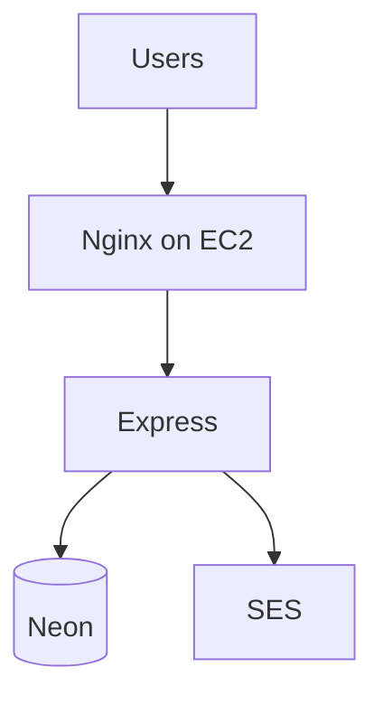

# What would you say if they ask about AWS?

Localhost is a real demo. If they ask "how does this look on AWS?" you tell the truth — you name only what you ran.

| What you ran | What you might say later |
| --- | --- |
| Express on EC2 | EC2, maybe ECS later |
| Neon | RDS when the budget exists |
| JWT you wrote | Cognito, maybe |
| SES | SES. You already did this |
| GitHub | public repo you can show |
| GitHub Actions | push writes `.env`, restarts pm2 |

Don't invent Cloudflare or Traefik. Slide 1 is the honest sketch. RDS is a sentence for later, not something you fake today.
