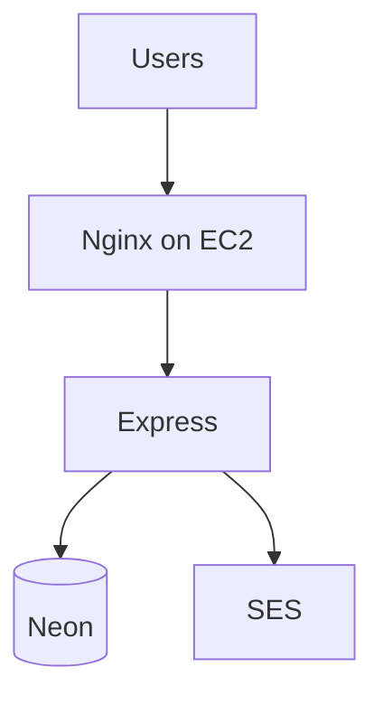

# What we actually ran

Judges are fine with localhost. They still ask "how would this look on AWS?" Tell the truth.

| What we ran today | What you'd say in a pitch |
| --- | --- |
| Express on EC2 | EC2, maybe ECS later |
| Neon | RDS when we're rich |
| JWT we wrote | Cognito, maybe |
| SES | SES. We already did this. |
| GitHub | public repo https://github.com/sreecharan-desu/club-portal-backend |
| GitHub Actions | **wired.** push writes full `.env`, `pm2 restart` |

Don't invent Cloudflare or Traefik. Slide 1 is the honest sketch. RDS is the sentence for later.
