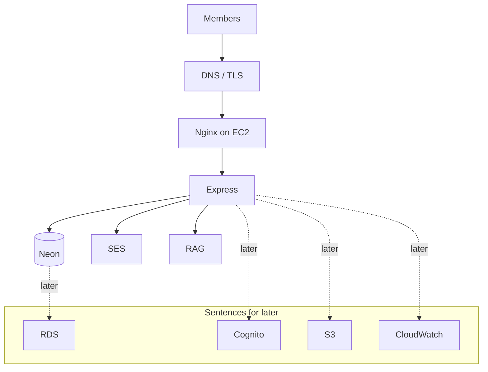

# What we ran vs what we pitch

Judges accept a local demo. They still want to hear how this grows on AWS. Tell the truth: what we touched today, then the managed upgrade.

| What we actually ran | The grown-up sentence |
| --- | --- |
| Express on EC2 | EC2 / ECS |
| Neon | Amazon RDS |
| JWT in our API | Cognito |
| SES SendEmail | SES |
| Docs pack | S3 |
| pm2 logs | CloudWatch |

You're not inventing SES and EC2 — you used them. Neon was the workshop memory; RDS is the production sentence. Next: tick the brief.
