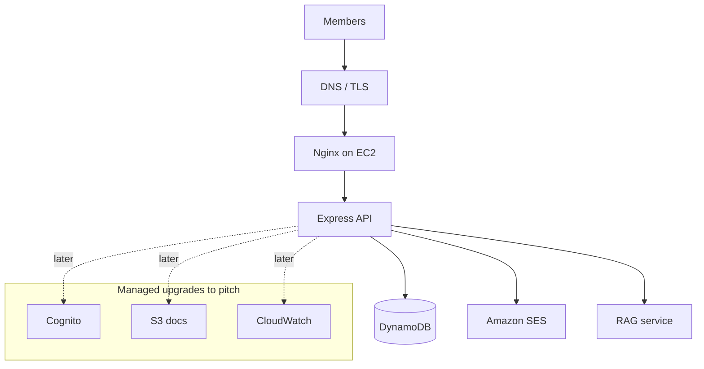

# AWS narrative

| Running today | Pitch analogue |
| --- | --- |
| Express on EC2 | EC2 / ECS |
| DynamoDB tables | DynamoDB (already) |
| JWT in our API | Cognito |
| Nodemailer → SES | SES |
| Document pack | S3 |
| pm2 logs | CloudWatch |

We already run DynamoDB, SES, and EC2. That is the spine — not fiction.
