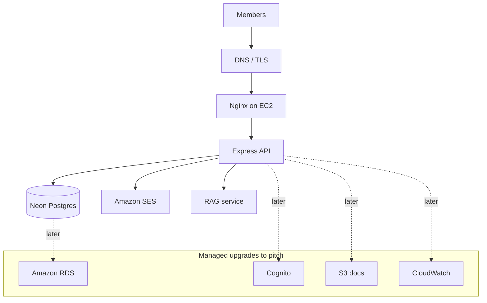

# AWS narrative

Judges are fine with a local demo. They still want to hear how this would look on AWS. So we tell the truth about what we run today, then the managed upgrade.

| What we actually run | What we'd say in the pitch |
| --- | --- |
| Express on EC2 | EC2 / ECS |
| Neon Postgres | Amazon RDS |
| JWT in our API | Cognito |
| Nodemailer → SES | SES |
| Document pack | S3 |
| pm2 logs | CloudWatch |

You're not inventing SES and EC2 — you already touched them. Neon is the workshop DB; RDS is the production sentence.
