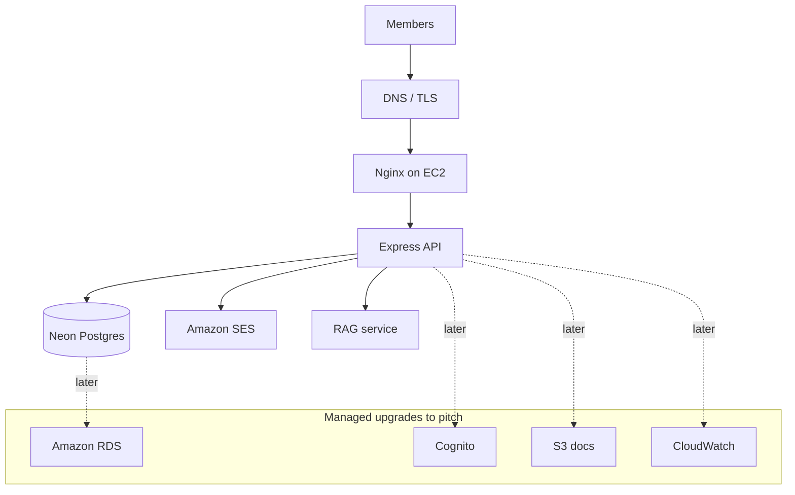

# AWS narrative

Judges accept a local demo. The pitch still needs a cloud map — say what you run today, then the managed upgrade.

| Running today | Pitch analogue |
| --- | --- |
| Express on EC2 | EC2 / ECS |
| Neon Postgres | Amazon RDS |
| JWT in our API | Cognito |
| Nodemailer → SES | SES |
| Document pack | S3 |
| pm2 logs | CloudWatch |

You already run SES and EC2. Neon is the workshop database; RDS is the production sentence.
