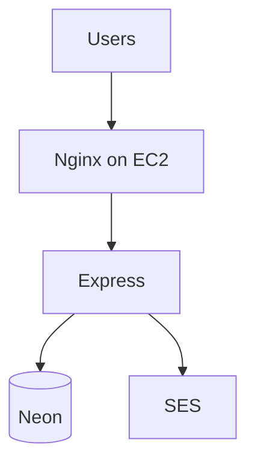

# What we actually ran

Judges are fine with localhost. They still ask "how would this look on AWS?" Tell the truth.

| What we ran today | What you'd say in a pitch |
| --- | --- |
| Express on EC2 | EC2, maybe ECS later |
| Neon | RDS when we're rich |
| JWT we wrote | Cognito, maybe |
| SES | SES. We already did this. |
| GitHub | public repo. clone on EC2 by hand |
| GitHub Actions | **not hooked up.** no repo secrets, no push-to-deploy |

Don't invent a bunch of services you didn't touch. You used SES and EC2. Neon is the workshop DB. RDS is the sentence for later.
