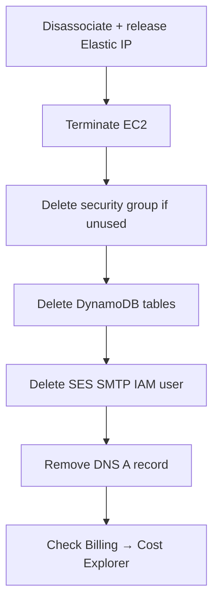

# Teardown — no surprise bills

Destroy in this order. Elastic IPs and running instances are what bite.



```bash
# 1) Elastic IP — release AFTER disassociate
aws ec2 describe-addresses --region ap-south-1
aws ec2 disassociate-address --association-id assoc-…
aws ec2 release-address --allocation-id eipalloc-…

# 2) Instance
aws ec2 terminate-instances --instance-ids i-… --region ap-south-1

# 3) DynamoDB
aws dynamodb delete-table --table-name club-portal-users --region ap-south-1
aws dynamodb delete-table --table-name club-portal-tokens --region ap-south-1

# 4) SES SMTP user (IAM)
aws iam delete-user --user-name ses-smtp-user-…

# 5) Optional: delete key pair from AWS (local .pem too)
aws ec2 delete-key-pair --key-name club-portal
```

Also:

- Remove `api` A record (or point it nowhere)
- Delete unused security groups
- Confirm Certbot renew cron is gone with the instance
- Billing console → confirm forecast drops over 24–48h
- Set a **budget alarm** once: Billing → Budgets → $5 email alert

Free tier ends. Idle Elastic IPs charge. DynamoDB on-demand is cheap until you forget tables exist — delete them.
