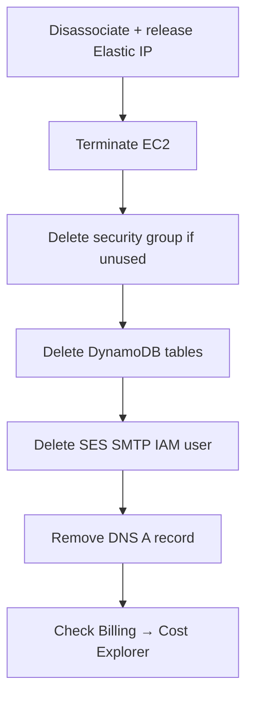

# Teardown — no surprise bills

Destroy in this order. Elastic IPs and running instances are what bite.



| Step | Command / action |
| --- | --- |
| 1 · Elastic IP | `disassociate-address` then `release-address` |
| 2 · Instance | `terminate-instances` |
| 3 · DynamoDB | `delete-table` for users + tokens |
| 4 · SES SMTP user | `iam delete-user` |
| 5 · Key pair | `delete-key-pair` + drop local `.pem` |
| 6 · DNS | remove `api` A record |
| 7 · Billing | Cost Explorer + $5 budget alarm |

```bash
aws ec2 describe-addresses --region ap-south-1
aws ec2 disassociate-address --association-id assoc-…
aws ec2 release-address --allocation-id eipalloc-…

aws ec2 terminate-instances --instance-ids i-… --region ap-south-1

aws dynamodb delete-table --table-name club-portal-users --region ap-south-1
aws dynamodb delete-table --table-name club-portal-tokens --region ap-south-1
```

Free tier ends. Idle Elastic IPs charge. On-demand DynamoDB is cheap until you forget the tables — delete them.
