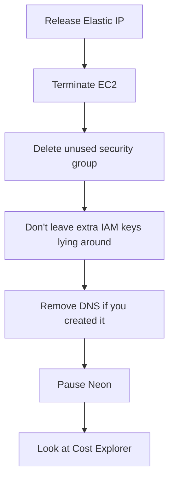

# Leave no surprise bill

Please don't leave AWS running overnight "just in case." Kill in this order — **Elastic IPs** are the sneaky charge.



| Step | Do this |
| --- | --- |
| 1 | Disassociate, then **release** the Elastic IP |
| 2 | Terminate the instance |
| 3 | Delete the workshop key pair + trash the `.pem` |
| 4 | Remove the `api` A record if you made one |
| 5 | Pause or delete the Neon project |
| 6 | Billing → a $5 budget alarm |

```bash
aws ec2 describe-addresses --region ap-south-1
aws ec2 disassociate-address --association-id assoc-…
aws ec2 release-address --allocation-id eipalloc-…
aws ec2 terminate-instances --instance-ids i-… --region ap-south-1
```

Free tier ends. Idle Elastic IPs still bill. Next: the last sentence.
