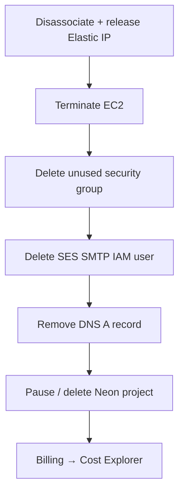

# Teardown — no surprise bills

Destroy AWS resources in order. Elastic IPs and running instances are what bite. Neon free projects can be paused or deleted in their console.



| Step | Action |
| --- | --- |
| 1 · Elastic IP | disassociate, then release |
| 2 · Instance | terminate |
| 3 · SES SMTP user | delete IAM user |
| 4 · Key pair | delete in AWS + drop local `.pem` |
| 5 · DNS | remove `api` A record |
| 6 · Neon | pause or delete the project |
| 7 · Billing | Cost Explorer + $5 budget alarm |

```bash
aws ec2 describe-addresses --region ap-south-1
aws ec2 disassociate-address --association-id assoc-…
aws ec2 release-address --allocation-id eipalloc-…
aws ec2 terminate-instances --instance-ids i-… --region ap-south-1
```

Free tier ends. Idle Elastic IPs still charge. Set a budget alarm once and leave the room clean.
