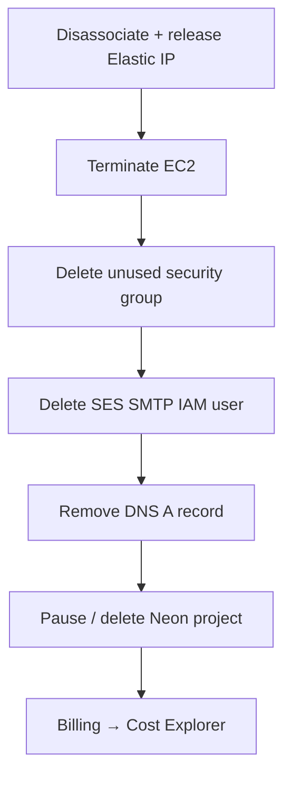

# Teardown — no surprise bills

Please don't leave AWS running overnight "just in case." Kill things in this order — Elastic IPs are the sneaky charge.



| Step | Do this |
| --- | --- |
| 1 · Elastic IP | disassociate, then release |
| 2 · Instance | terminate |
| 3 · SES SMTP user | delete the IAM user |
| 4 · Key pair | delete in AWS + trash the local `.pem` |
| 5 · DNS | remove the `api` A record |
| 6 · Neon | pause or delete the project |
| 7 · Billing | Cost Explorer + a $5 budget alarm |

```bash
aws ec2 describe-addresses --region ap-south-1
aws ec2 disassociate-address --association-id assoc-…
aws ec2 release-address --allocation-id eipalloc-…
aws ec2 terminate-instances --instance-ids i-… --region ap-south-1
```

Free tier ends. Idle Elastic IPs still bill. Set the budget alarm once — future you will say thanks.
