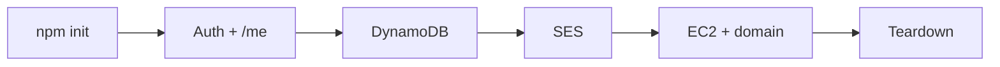

# Close

From zero to a signed-in member on `/me`, mail on SES, data in DynamoDB, API on Ubuntu — then a clean bill.

Frontend consumes the contract.  
RAG fills the answers.  
This layer stays correct, deployable, and disposable.
