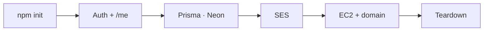

# Close

That's the path: TypeScript API, Prisma on Neon, mail through SES, Ubuntu behind a domain — then a clean bill.

Frontend consumes the contract. RAG fills grounded answers. Our job was to keep this layer boring, correct, and something you can actually ship — and tear down.
